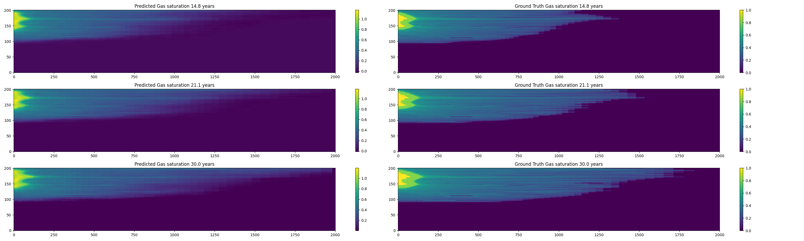

# CO2-U-Net

This projects trains a self-attention based U-Net to predict evolution of the pressure build up and gas saturation in a CO2 resevrvoir 30 years after injection using various geological fields, like permeability, porosity,temperature and the perforation interval.

### Results for Gas Saturation

The image below shows the prediction for the last 3 time steps out of 24.
